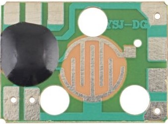
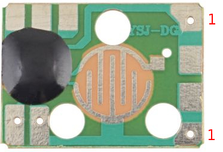
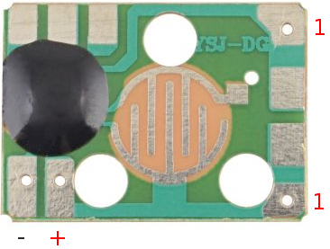
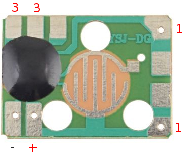
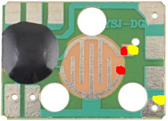

# Modul psího štěkání

Na [GME](https://www.gme.cz/modul-imitujici-psi-stekot) jsem si koupil modul psího štěkání. Protože kdo by něčemu takovému mohl odolat, žejo?

## Seznam součástek
- [modul psího štěkotu](https://www.gme.cz/modul-imitujici-psi-stekot)
- 100Ω odpor
- 2pin male header ([obrázek pro představu](https://www.don-audio.com/2-Pin-header-strip-male-254mm-goldplated-1x2))
- [piezoměnič](https://www.gme.cz/ld-bzpn-1705)
- 2 dráty na připájení buzzeru
- 2 propojovací kabely (k arduinu)

## Postup
Vzhledem k jednoduchosti celého zařízení asi nikde nenajdete nějaký podrobný postup, jak vše uvést do provozu. Vycházel jsem z obrázku, který je na GME.

Jako první jsem na mezi dvě dirky na kratší straně modulu připájel 100Ω odpor.

Na zbylé dvě dirky na delší straně modulu připájet 2pin header (pro snažší připojení zdroje napájení). Je možné napájet dráty přímo, ale takhle se mi to zdálo hezčí.

2pin slouží k přivedení napájení. Poly jsou označeny v obrázku.

Posledním krokem je vyvedení samotného piezoměniče. Ten se připojuje naproti napájení, na opačnou stranu.

## Zapojení

1) Na piny označené (+) a (-) přiveďte +3.3V a GND z Arduina
2) Na pozice (3) připojte piezoměnič.

## Použití

Po spojení spínače umístěného uprostřed modulu (označeno červeně), popřípadě spínače a vývodu rezistoru (označeno žlutě) modul 3x po sobě zaštěká.

